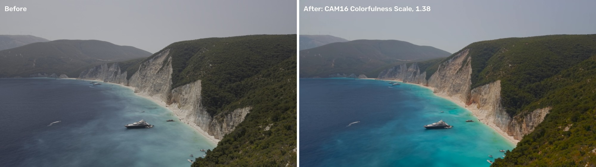
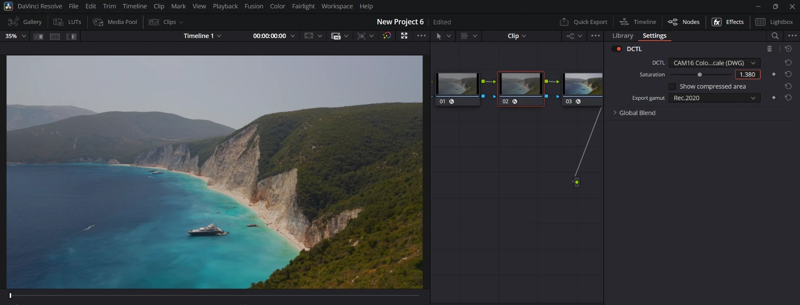
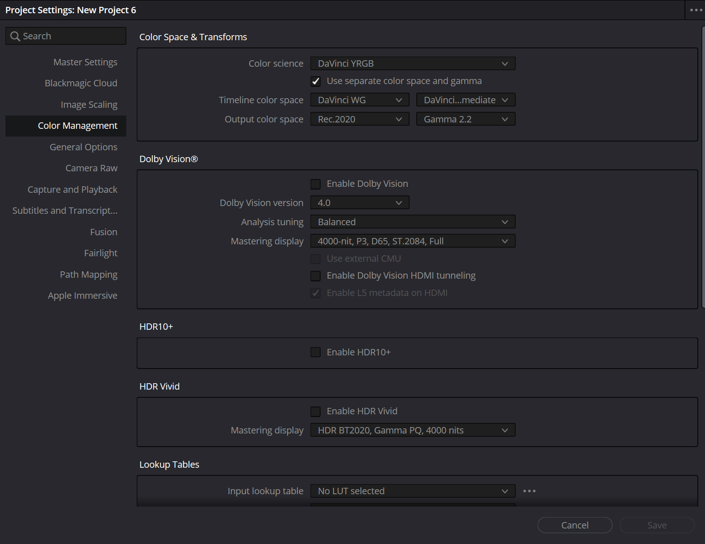
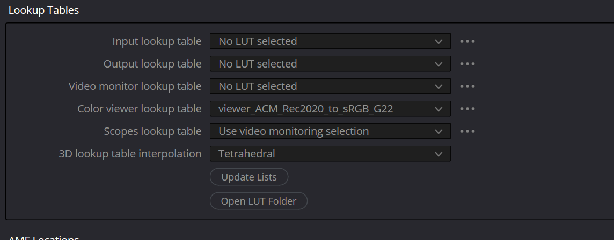

# CAM16 Colorfulness Scale (DCTL for DaVinci Resolve)

A saturation control that treats every color the same. It works in the CAM16 color appearance model: it boosts **colorfulness** while keeping **hue** and **lightness** exactly as they were, so blues don't jump out while greens stay flat, and nothing shifts in hue or brightness.

*Left: Thatcher Freeman's IDT only. Right: the same frame with CAM16 Colorfulness Scale at 1.38.*

It works with any camera. All you need is an IDT that brings your footage into DaVinci Wide Gamut / DaVinci Intermediate: for example, Resolve's own CST for Sony, Canon, ARRI, RED and Blackmagic, or [Thatcher Freeman's DWG transforms](https://github.com/thatcherfreeman/dwg-transforms) for DJI drones and GoPro.

## Install
1. Copy `CAM16 Colorfulness Scale (DWG).dctl` to
   - Windows: `C:\ProgramData\Blackmagic Design\DaVinci Resolve\Support\LUT\`
   - macOS: `/Library/Application Support/Blackmagic Design/DaVinci Resolve/LUT/`
2. Restart Resolve, or go to Project Settings → Color Management → Update Lists.
3. On the Color page, drag **Effects → DCTL** onto a node and choose the file from **DCTL List**.

## How I use it
Three serial nodes:

1. **IDT:** Thatcher Freeman's DCTL for my camera (DJI Air 3S D-Log M; his GPLog ones for GoPro) → DaVinci Wide Gamut / DaVinci Intermediate
2. **CAM16 Colorfulness Scale:** Saturation 1.38, Export gamut = my delivery space
3. **CST:** DaVinci Wide Gamut / Intermediate → Rec.2020 (or Rec.709), Gamma 2.2

## Project settings
Color science is **DaVinci YRGB** (not color managed), with the timeline set to DaVinci Wide Gamut / DaVinci Intermediate. All the color management happens in the nodes above. I deliver in Rec.2020 Gamma 2.2.

## Viewer on Windows
Without HDR enabled, Windows treats the Resolve viewer as sRGB, so a Rec.2020 timeline looks washed out there. The viewer LUT in this repo, `viewer_ACM_Rec2020_to_sRGB_G22.cube`, converts Rec.2020 Gamma 2.2 to sRGB Gamma 2.2. Colors that sRGB can't show are mapped to its edge. Put it in the LUT folder and select it under Project Settings → Color Management → Lookup Tables → **Color viewer lookup table**. After that, the viewer matches a color-managed player like mpv. It only affects the viewer, not your renders. If you deliver in Rec.709 Gamma 2.2, you don't need it.

## Controls
- **Saturation**: how much to scale colorfulness (1.0 = no change). Around 1.38 works well for bright daylight footage, but that's a taste choice, not a rule.
- **Export gamut**: set it to the output gamut of your final CST (Rec.709, P3-D65, DCI-P3 or Rec.2020). Colors are rolled off smoothly toward the edge of that gamut instead of being clipped, with their hue and lightness intact.
- **Show compressed area**: highlights in magenta the pixels where the boost is being held back by the gamut edge.

## Notes
- Only the lower edge of the gamut is enforced. Highlights above 1.0 are left to the CST's tone mapping, and in testing the bright sky still received about ×1.36 of a ×1.38 boost.
- Tested on Windows / NVIDIA (Resolve Studio 21.1). Not yet tested on macOS / Metal.
- CAM16: Li et al. 2017, standardized by the CIE as CIECAM16 (CIE 248:2022).

## License
MIT
